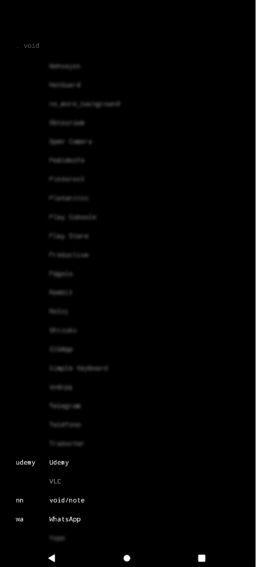

<div align="center">

# VOID Launcher


Un launcher. Pantalla oscura, buscador tipo terminal, alias para todo.

</div>

---

<p align="center">
  
  
  
</p>

---

## Por qué existe

Nació de la necesidad de tener algo ligero, sencillo y rápido que minimizara la fricción al usar el teléfono. Sin iconos, sin distracciones, sin permisos innecesarios.

## Cómo funciona

Tocas cualquier parte de la pantalla y aparece el buscador. Escribes las primeras letras de la app y listo. Si solo hay una coincidencia, la abre directo sin confirmar nada.

La búsqueda aprende de ti. Si siempre abres Spotify a las 7am, a esa hora aparece de primero sin escribir ni una letra. Todo pasa en el teléfono, sin servidores, sin internet, sin recopilar nada.

## Alias

Desde `.void` puedes asignarle un nombre corto a cualquier app instalada. Una vez asignado, ese nombre se convierte en un comando.

```
fb          → abre Facebook (si le asignaste el alias "fb")
yt          → abre YouTube
nn          → abre VOID Note
```

## Comandos

| Comando | Qué hace |
|---|---|
| `.all` | Lista todas las apps instaladas |
| `.void` | Abre el panel de alias |

## Lo que no tiene

- Iconos
- Widgets
- Animaciones
- Notificaciones
- Conexión a internet
- Publicidad
- Rastreo de ningún tipo

## Números

- **1 permiso**: leer apps instaladas (Android 11+ lo exige)
- **~100KB** el APK release con ProGuard
- **Android 4.1+** compatible

## Arquitectura

```
core/
├── AppLauncher.java       — lanza apps por packageName
├── CommandRouter.java     — parsea comandos: alias, flags, args
└── PluginRegistry.java    — auto-registro de alias al instalar plugins

data/
├── AliasRepository.java   — guarda alias↔packageName en SharedPreferences
└── ContextualApps.java    — top 5 apps por ventana horaria ±90min

ui/
├── LauncherActivity.java  — pantalla principal, gestiona ciclo de vida
├── ClockView.java         — reloj centrado con círculo decorativo
├── GestureView.java       — captura toques en la pantalla
├── QuickSearchDialog.java — buscador, filtro y enrutamiento de comandos
├── QuickSearchLayout.java — layout del buscador
└── SettingsDialog.java    — panel visual para asignar alias a apps
```

## Instalar

Descarga el APK desde [Releases](https://github.com/Hes01/app-void/releases) e instálalo. Necesitas permitir instalación desde fuentes desconocidas si no viene de la Play Store.

O clona y compila:

```bash
git clone https://github.com/Hes01/app-void.git
cd app-void
./gradlew assembleRelease
```

## Ecosistema VOID (próximamente)

| Comando | Qué hará |
|---|---|
| `.<alias> texto` | Lanza la app pasándole el texto como argumento |
| `.<alias> l` | Lista el contenido del plugin (si lo soporta) |
| `.<alias> del N` | Elimina el ítem N del plugin |
| `.<alias> -d` | Desinstala la app |

VOID está pensado como un sistema modular. Cada pieza es una app independiente de menos de 100KB.

- **VOID** — el launcher (este repo)
- **VOID Note** — bloc de notas minimalista

---

<div align="center">
Hecho para gente que quiere entrar, hacer lo que tiene que hacer y ya.
</div>
