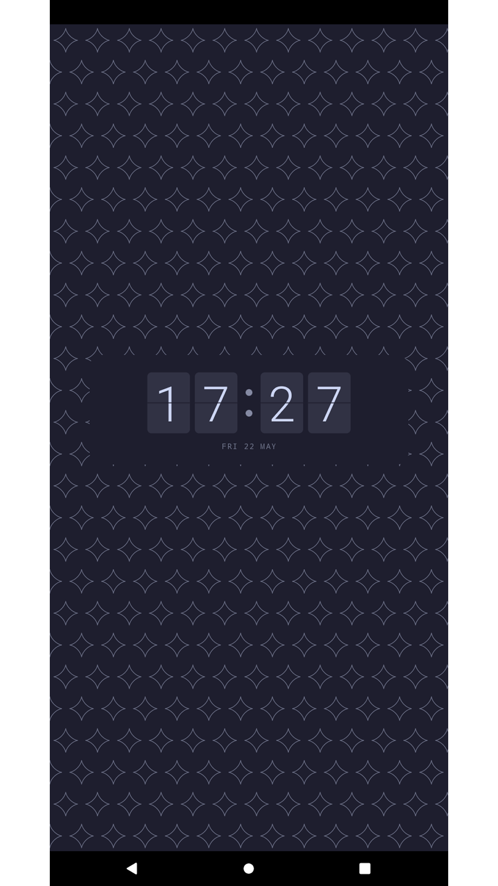
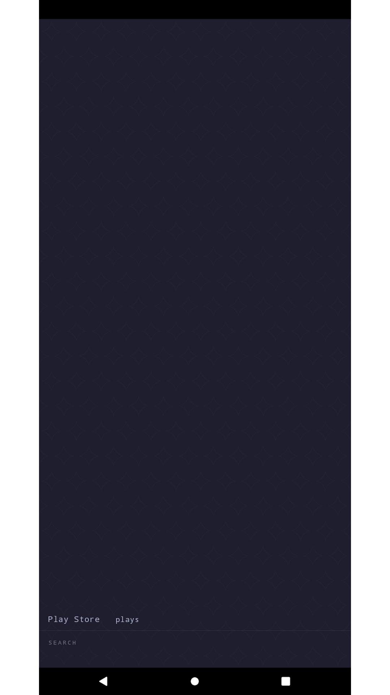
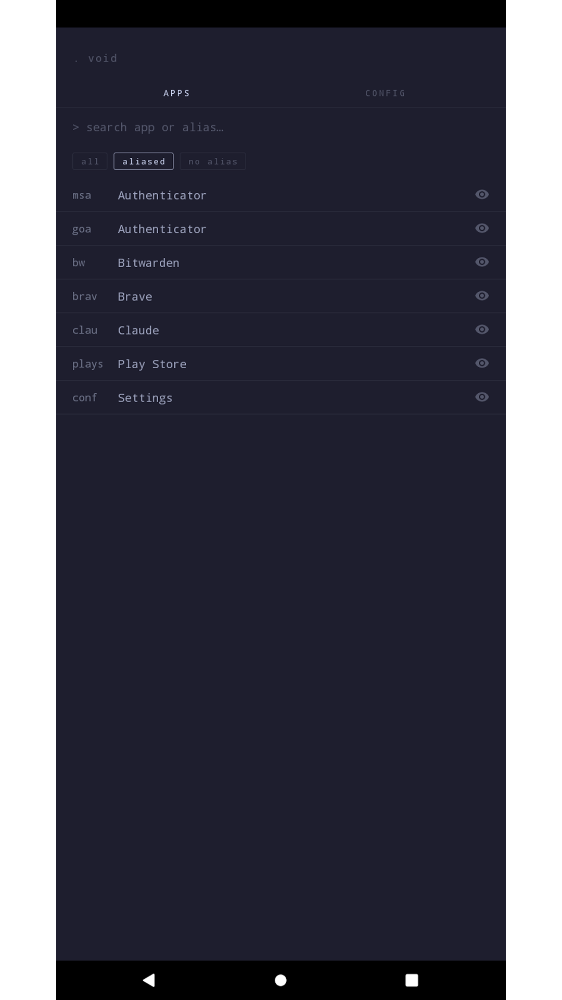
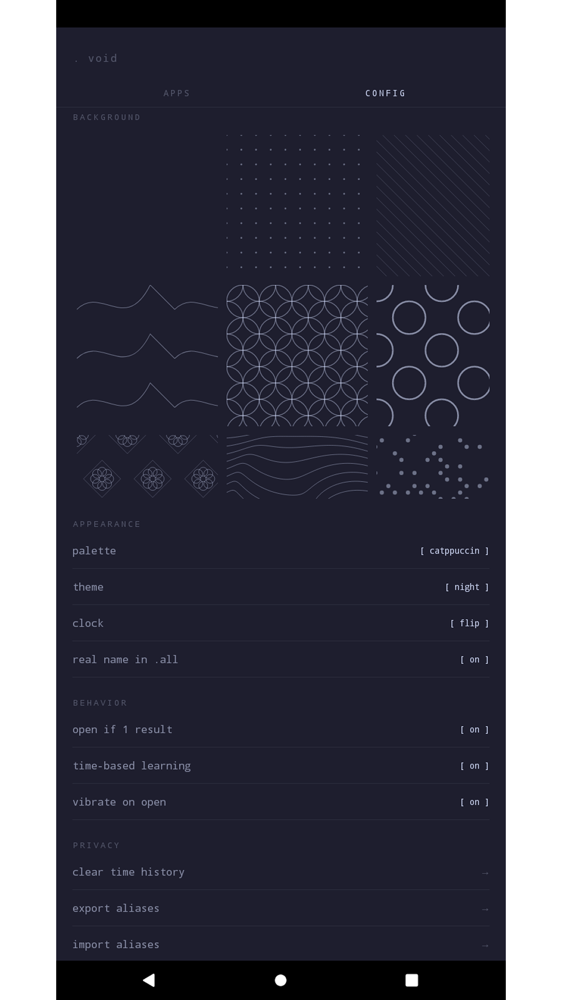
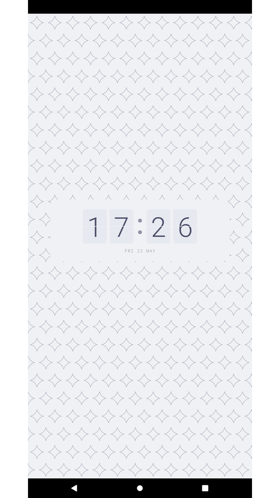
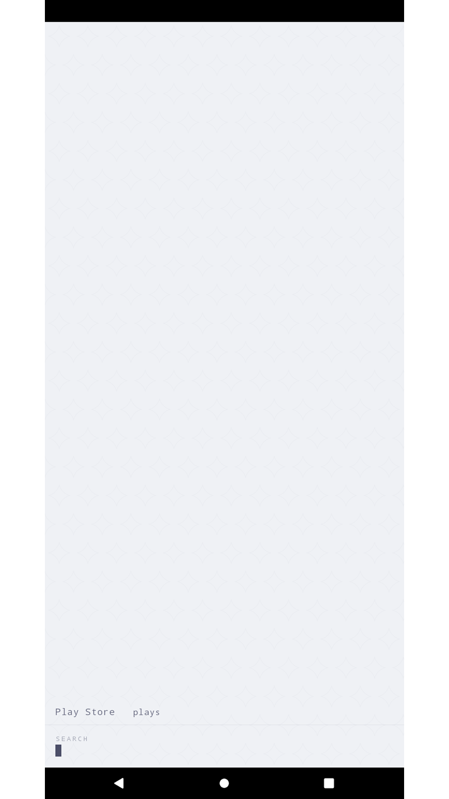
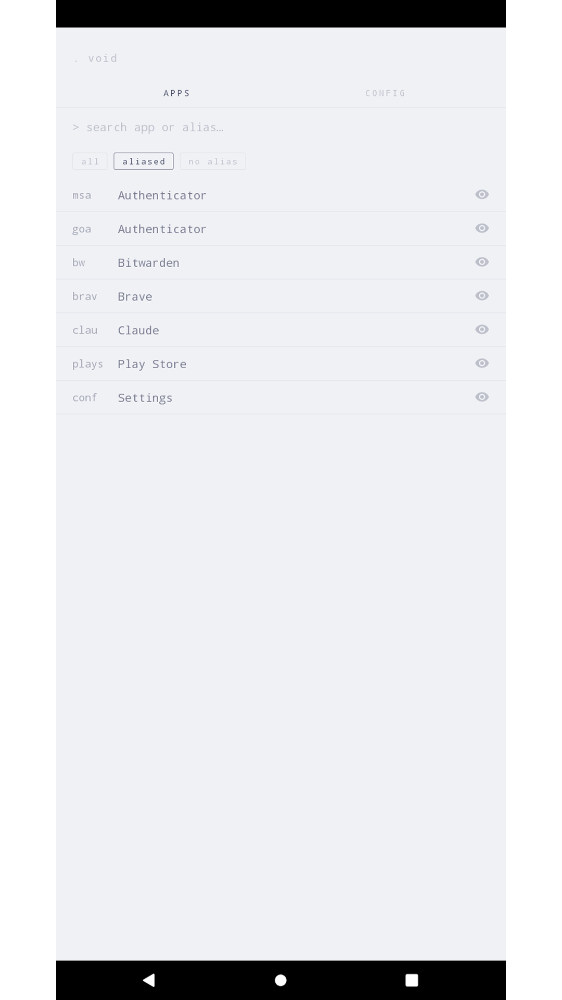
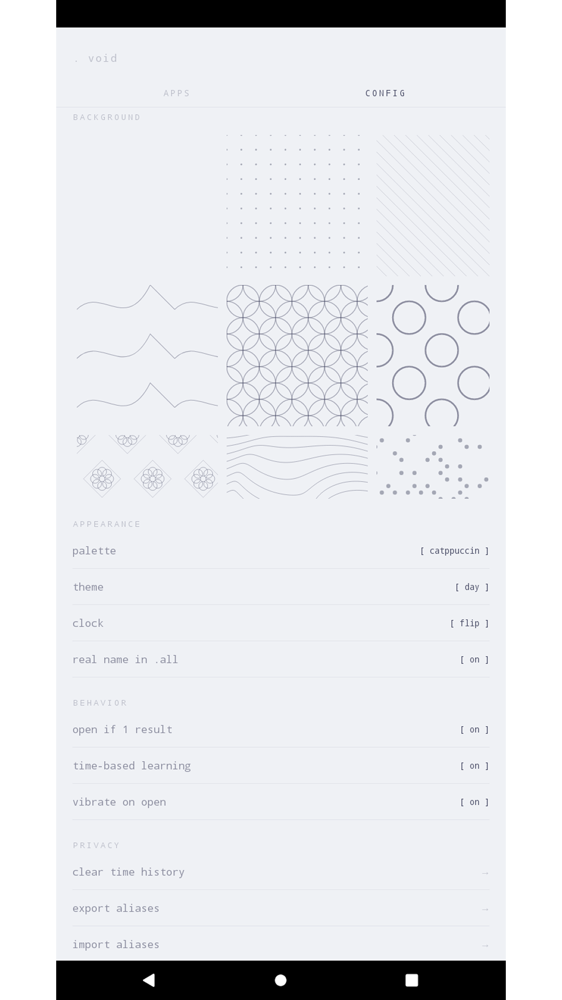

<div align="center">

# VOID Launcher


Un launcher. Pantalla oscura, buscador tipo terminal, alias para todo.

</div>

---

### Tema oscuro

<p align="center">
  
  
  
  
</p>

### Tema claro

<p align="center">
  
  
  
  
</p>

<p align="center"><sub>Inicio · Buscador · Alias · Configuración</sub></p>

---

## Por qué existe

Nació de la necesidad de tener algo ligero, sencillo y rápido que minimizara la fricción al usar el teléfono. Sin iconos, sin distracciones, sin permisos innecesarios.

## Cómo funciona

Tocas cualquier parte de la pantalla y aparece el buscador. Escribes las primeras letras de la app y listo. Si solo hay una coincidencia, la abre directo sin confirmar nada.

La búsqueda aprende de ti. Si siempre abres Spotify a las 7am, a esa hora aparece de primero sin escribir ni una letra. Todo pasa en el teléfono, sin servidores, sin internet, sin recopilar nada.

Mantén presionado para abrir los ajustes directamente.

## Alias

Desde ajustes puedes asignarle un nombre corto a cualquier app instalada. Una vez asignado, ese nombre se convierte en un comando.

```
fb    → abre Facebook
yt    → abre YouTube
tw    → abre Twitter
```

## Comandos

| Comando | Qué hace |
|---|---|
| `.all` | Lista todas las apps instaladas |
| `.void` | Abre ajustes (alias, fondos, reloj, tema) |

## Características

- **Sugerencias inteligentes** — muestra tus apps más usadas por franja horaria
- **Alias** — renombra cualquier app como quieras
- **Ocultar apps** — sin desinstalarlas
- **Fondos matemáticos** — espiral, Hilbert, astroide y más
- **Estilos de reloj** — texto, 7 segmentos, flip
- **8 paletas de color** — modo claro, oscuro y automático
- **Búsqueda** — por nombre o alias

## Lo que no tiene

- Iconos
- Widgets
- Animaciones innecesarias
- Notificaciones
- Conexión a internet
- Publicidad
- Rastreo de ningún tipo

## Números

- **1 permiso**: leer apps instaladas (Android 11+ lo exige)
- **~60KB** el AAB release con ProGuard
- **Android 5.0+** compatible

## Arquitectura

```
core/
├── AppLauncher.java       — lanza apps por packageName
├── CommandRouter.java     — parsea comandos: alias, flags, args
└── PluginRegistry.java    — auto-registro de alias al instalar plugins

data/
├── AliasRepository.java   — alias↔packageName en SharedPreferences
├── HiddenAppsRepository   — apps ocultas
├── LaunchRepository.java  — historial de lanzamientos por hora
├── ThemeRepository.java   — paleta y modo de tema
└── WallpaperRepository    — fondo de pantalla seleccionado

ui/
├── LauncherActivity.java  — pantalla principal, ciclo de vida
├── GestureView.java       — tap y long press en la pantalla
├── QuickSearchDialog.java — buscador, filtro y enrutamiento
├── SettingsDialog.java    — ajustes: apps, alias, configuración
├── SettingsAppsPanel.java — lista de apps con alias y visibilidad
├── SettingsConfigPanel.java — reloj, tema, paleta, comportamiento
├── PatternView.java       — fondo matemático generativo
└── ClockView.java         — reloj con múltiples estilos
```

## Instalar

Disponible en [Google Play](https://play.google.com/store/apps/details?id=om.hes01.voidlauncher) o descarga el APK desde [Releases](https://github.com/Hes01/app-void/releases).

O clona y compila:

```bash
git clone https://github.com/Hes01/app-void.git
cd app-void
./gradlew bundleRelease
```

## Ecosistema VOID (próximamente)

VOID está pensado como un sistema modular. Cada pieza es una app independiente de menos de 100KB.

- **VOID** — el launcher (este repo)
- **VOID Note** — bloc de notas minimalista

---

<div align="center">
Hecho para gente que quiere entrar, hacer lo que tiene que hacer y ya.
</div>
